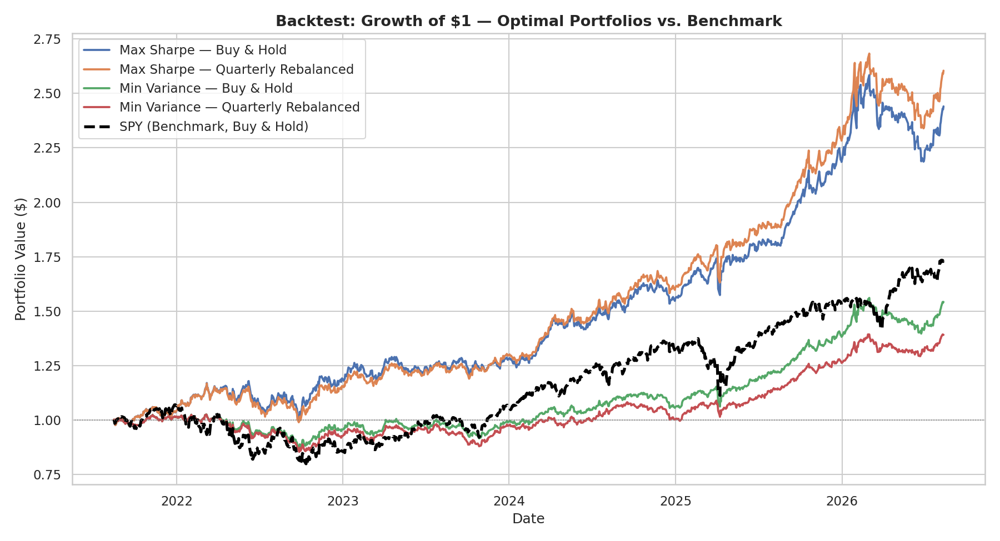
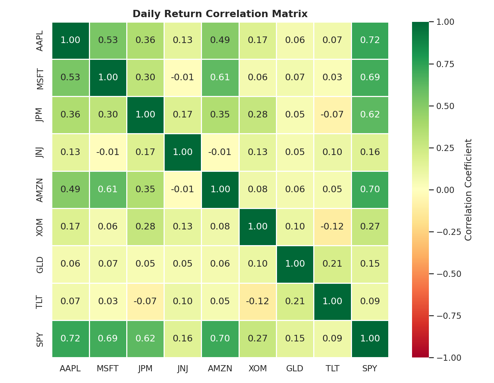
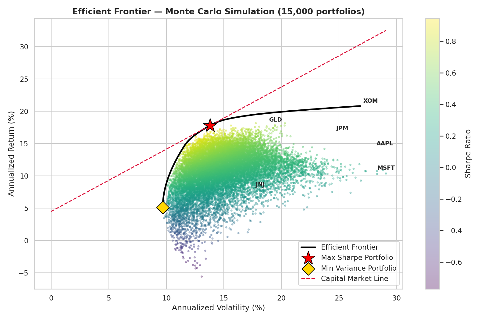

# 📈 Investment Portfolio Analytics: Risk, Optimization & Backtesting

**A full-stack quantitative investment analysis project** — from raw market data to an optimized, backtested portfolio and an interactive dashboard — built as an academic project for the *Investment Management* course.

> **TL;DR:** Using 5 years of daily data across 8 assets (equities, gold, and Treasury bonds), I built a Markowitz-optimized portfolio that achieved a **21.3% annualized return at 14.0% volatility (Sharpe 1.14)** — outperforming the S&P 500 benchmark (11.6% return, 17.3% volatility, Sharpe 0.47) on both return *and* risk.

---

## Table of Contents
- [Project Motivation](#project-motivation)
- [Key Results](#key-results)
- [Methodology](#methodology)
- [Repository Structure](#repository-structure)
- [How to Run](#how-to-run)
- [Interactive Dashboard](#interactive-dashboard)
- [Investment Universe](#investment-universe)
- [Detailed Findings by Stage](#detailed-findings-by-stage)
- [Tech Stack](#tech-stack)
- [Limitations & Future Work](#limitations--future-work)
- [Author](#author)

---

## Project Motivation

This project applies core **Modern Portfolio Theory (Markowitz, 1952)** concepts — diversification, the efficient frontier, and risk-adjusted return — to a real, multi-asset-class portfolio using actual market data rather than textbook toy examples. It was built for a university Investment Management course and designed end-to-end as a demonstration of applied data analytics: data engineering, statistical analysis, mathematical optimization, backtesting, and interactive visualization.

**Guiding question:** *Can a data-driven, mathematically optimized portfolio of common assets meaningfully beat a passive S&P 500 investment on a risk-adjusted basis?*

---

## Key Results

| Strategy | Annualized Return | Annualized Volatility | Sharpe Ratio | Max Drawdown |
|---|---:|---:|---:|---:|
| 🏆 **Max Sharpe — Quarterly Rebalanced** | **21.3%** | 14.0% | **1.14** | -15.2% |
| Max Sharpe — Buy & Hold | 19.7% | 14.7% | 1.00 | -15.4% |
| Min Variance — Buy & Hold | 9.1% | 10.4% | 0.46 | -15.4% |
| Min Variance — Quarterly Rebalanced | 6.8% | 9.7% | 0.28 | -16.7% |
| **S&P 500 (SPY) — Benchmark** | 11.6% | 17.3% | 0.47 | **-25.4%** |

The optimized portfolio not only delivered nearly **2x the benchmark's annualized return**, it did so with **lower volatility and a shallower maximum drawdown** — the central promise of diversification theory, confirmed empirically.

<p align="center">
  
</p>

---

## Methodology

The analysis follows a 9-stage pipeline, each implemented as an independent, reusable Python module in `src/`:

1. **Data Collection** — 5 years (Aug 2021–Aug 2026) of daily OHLCV data for 9 tickers, sourced from WSJ Market Data.
2. **Data Cleaning** — standardization, validation, and alignment onto a common trading calendar (`src/data_cleaning.py`).
3. **Exploratory Data Analysis** — price trends, cumulative returns, correlation structure, return distributions, rolling volatility (`src/eda.py`).
4. **Risk & Return Metrics** — Sharpe, Sortino, Calmar, historical & parametric VaR, CVaR, Beta, Jensen's Alpha (`src/risk_metrics.py`).
5. **Portfolio Optimization** — Markowitz efficient frontier via constrained quadratic optimization (SciPy SLSQP) + a 15,000-portfolio Monte Carlo simulation for visual validation (`src/portfolio_optimization.py`).
6. **Backtesting** — Buy & Hold vs. quarterly-rebalanced simulations of both the Max Sharpe and Minimum Variance portfolios vs. the SPY benchmark (`src/backtesting.py`).
7. **Interactive Dashboard** — a Streamlit app exposing every stage of the analysis interactively (`dashboard/app.py`).

All daily returns are computed as both **simple** and **log** returns; annualization uses 252 trading days/year throughout, per standard industry convention.

---

## Repository Structure

```
investment-portfolio-analysis/
├── data/
│   ├── raw/                    # Original WSJ CSV exports (9 tickers)
│   └── processed/              # Cleaned, aligned, and derived datasets
├── src/                        # Core analytics pipeline (importable Python package)
│   ├── config.py                   # Central configuration (paths, tickers, assumptions)
│   ├── data_cleaning.py            # Step 2: ingestion & cleaning
│   ├── eda.py                      # Step 3: exploratory analysis & visualization
│   ├── risk_metrics.py             # Step 4: risk/return metric suite
│   ├── portfolio_optimization.py   # Step 5: Markowitz optimization + Monte Carlo
│   └── backtesting.py              # Step 6: strategy backtesting
├── dashboard/
│   └── app.py                  # Step 7: interactive Streamlit dashboard
├── figures/                    # All generated charts (PNG, 150 DPI)
├── requirements.txt
└── README.md
```

---

## How to Run

```bash
# 1. Clone the repository
git clone https://github.com/<your-username>/investment-portfolio-analysis.git
cd investment-portfolio-analysis

# 2. Install dependencies
pip install -r requirements.txt

# 3. Run the full pipeline in order
python -m src.data_cleaning
python -m src.eda
python -m src.risk_metrics
python -m src.portfolio_optimization
python -m src.backtesting

# 4. Launch the interactive dashboard
streamlit run dashboard/app.py
```

Each stage reads its inputs from `data/processed/` (produced by the prior stage) and writes its own outputs there — the pipeline is fully reproducible from the raw CSVs in `data/raw/`.

---

## Interactive Dashboard

The Streamlit dashboard (`dashboard/app.py`) provides an explorable interface across five views:

| Tab | Contents |
|---|---|
| 🏠 Overview | Asset universe, sample period, quick performance snapshot |
| 💹 Price & Returns | Interactive normalized price charts, cumulative returns, return distributions |
| ⚠️ Risk Analysis | Full risk metric table, correlation heatmap, risk-return scatter |
| 🎯 Portfolio Optimization | Optimal allocations, efficient frontier |
| 🔁 Backtest | Strategy comparison table and equity curves |

> 💡 *A live deployed version can be added via [Streamlit Community Cloud](https://streamlit.io/cloud) — see the dashboard section for local run instructions.*

---

## Investment Universe

| Ticker | Name | Sector / Asset Class |
|---|---|---|
| AAPL | Apple Inc. | Technology |
| MSFT | Microsoft Corp. | Technology |
| JPM | JPMorgan Chase & Co. | Financials |
| JNJ | Johnson & Johnson | Healthcare |
| AMZN | Amazon.com Inc. | Consumer Discretionary |
| XOM | Exxon Mobil Corp. | Energy |
| GLD | SPDR Gold Shares | Commodities (Gold) |
| TLT | iShares 20+ Yr Treasury Bond ETF | Fixed Income |
| SPY | SPDR S&P 500 ETF Trust | Benchmark (Equity Index) |

The universe was deliberately constructed to span multiple sectors and asset classes (equities across 5 sectors, gold, and long-duration Treasuries) to create meaningful diversification opportunities for the optimization stage.

---

## Detailed Findings by Stage

### Exploratory Data Analysis
Correlation analysis revealed that **GLD and TLT exhibit near-zero correlation with the equity holdings** (0.05–0.21), identifying them early as the most promising diversifiers. Return distributions for growth stocks (AAPL, MSFT, AMZN) showed visible fat tails, motivating the use of VaR/CVaR rather than standard deviation alone in the risk stage.

<p align="center">
  
</p>

### Risk & Return Metrics
GLD (Sharpe 0.82) and XOM (Sharpe 0.75) were the top individual risk-adjusted performers over the sample period; TLT was the clear laggard (Sharpe −0.96), reflecting the impact of the rising-rate environment on long-duration bonds.

### Portfolio Optimization
The Maximum Sharpe Ratio portfolio allocated **50% to GLD, 23% to XOM, 17% to JPM, 7% to AAPL, and 3% to JNJ** — a solution the optimizer arrived at purely from the data, without any sector-allocation heuristics, yet it aligns closely with classic "growth + defensive hedge" portfolio construction principles.

<p align="center">
  
</p>

### Backtesting
Quarterly rebalancing **improved** the Max Sharpe portfolio's risk-adjusted return (systematically harvesting gains from outperforming assets) but **hurt** the Minimum Variance portfolio — an interesting asymmetry suggesting rebalancing benefit depends on the underlying return-generating process of the target allocation.

---

## Tech Stack

- **Data processing:** pandas, NumPy
- **Statistics & optimization:** SciPy (`scipy.optimize.minimize`, SLSQP)
- **Visualization:** Matplotlib, Seaborn, Plotly
- **Dashboard:** Streamlit
- **Data source:** WSJ Market Data (historical daily prices)

---

## Limitations & Future Work

- **Sample dependency:** All metrics are historical (2021–2026) and not forward-looking guarantees; the risk-free rate is a fixed assumption (4.5% annualized) rather than a time-varying rate series.
- **No transaction costs or taxes** are modeled in the backtest, which would reduce real-world returns, especially for the rebalanced strategies.
- **Long-only, static universe:** the optimizer does not consider short positions, leverage, or dynamically changing the investable universe over time.
- **Future extensions:** factor-based risk decomposition (Fama-French), a rolling/expanding-window backtest to test parameter stability, and Black-Litterman optimization to incorporate subjective return views.

---

## Author

**Parnaz Ali**
Investment Management — Islamic Azad University, Science and Research Branch
An academic course project for Investment Management.

📧 [parnazali1383@gmail.com](mailto:parnazali1383@gmail.com) | 💻 [GitHub](https://github.com/ParnazAli)

---

*This project is for academic and educational purposes only and does not constitute investment advice.*
